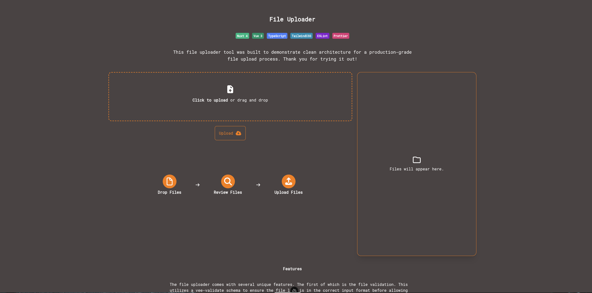

# File Uploader


This file uploader tool was built to demonstrate clean architecture for a
production-grade file upload process. Thank you for trying it out!

## Stack

Nuxt 4, Vue 3, TypeScript, TailwindCSS.

## Setup

Make sure to install dependencies:

```bash
npm ci
```

## Development Server

Start the development server on `http://localhost:3000`:

```bash
npm run dev
```
